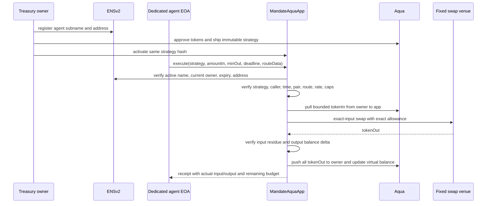

# Mandate Agent Context

Use this file to orient an agent with no prior conversation. It records settled product decisions and verified protocol mechanics; normative behavior lives in the linked specifications.

## 1. What Mandate is

Mandate is an ETHOnline 2026 product for **identity-bound, revocable DeFi execution**. A treasury owner keeps assets in its wallet, gives one dedicated agent signer an ENSv2 identity, and authorizes that signer to execute one immutable Aqua strategy inside explicit onchain limits.

> The agent receives authority, not custody: it can invoke one allowed token conversion, for bounded amounts, before expiry, while every successful transfer is enforced by the same contract that checks the mandate.

## 2. Honest correction to the original idea

- An ENS name is not authentication by itself. The contract verifies current ENSv2 registry state, expiry, token ownership, and resolver address.
- A simulation endpoint is not authorization. It is a gas-saving preview; execution repeats all checks onchain.
- Aqua does not make arbitrary agent code safe. Aqua supplies maker-controlled virtual balances and pull/push settlement; `MandateAquaApp` owns authorization, route constraints, accounting, and reentrancy safety.
- The agent never receives the treasury owner's private key. MVP uses a dedicated low-value EOA containing only enough native token for gas.
- Mandate is not for ordinary retail swaps. It is for a DAO, market maker, fund, or protocol treasury delegating a narrow recurring action.

## 3. Decisions already made

1. Build one product for the 1inch Aqua, ENSv2, and Bazantic opportunities; avoid sponsor collage.
2. MVP has one treasury maker, one dedicated agent EOA, one ENSv2 subname identity, one token pair, one fixed settlement target and selector, and one immutable Aqua strategy.
3. The owner wallet retains tokens between transactions and approves Aqua; the agent wallet receives no treasury assets.
4. `MandateAquaApp` is non-upgradeable for the hackathon proof.
5. Strategy parameters include maker, agent, ENS registry/resolver identity, pair, route target/selector, minimum rate, per-call cap, cumulative cap, activation window, and salt.
6. The strategy hash is `keccak256(abi.encode(strategy))` and must equal Aqua's shipped strategy hash.
7. Output always returns to the maker wallet through `Aqua.push`. No agent-selected recipient.
8. Owner can stop execution through Mandate revocation, Aqua `dock`, or ENS identity revocation/expiry.
9. Policy input is typed. Plain language may explain or draft values but never determines contract behavior.
10. Simulation returns `PASS`, `FAIL`, or `UNKNOWN` with reason codes and expected token movement.
11. Bazantic hosts a new Mandate Inspector paid service and a Recipe that combines it with a live 1inch data/trace service.
12. Signed-intent relaying, smart-account session keys, multiple strategies, dynamic policy edits, and autonomous strategy selection are post-MVP only.

Do not reopen these decisions without new primary-source or runtime evidence.

## 4. Verified protocol mechanics

### Aqua

Aqua stores virtual balances at `maker -> app -> strategyHash -> token`. `ship` publishes immutable strategy bytes and initial virtual balances; `dock` clears all strategy tokens. During execution, only the registered app can `pull` maker tokens; any caller can `push` tokens back to the maker for an active strategy. Physical tokens remain in the maker wallet until a pull and return to that wallet on push. Aqua's source explicitly requires app-level pricing, callback, reentrancy, and accounting correctness.

### ENSv2

ENSv2 Permissioned Registry uses ERC-1155 singleton ownership, expiries, subregistries, and Enhanced Access Control. Token IDs can change after role updates, so Mandate derives the label ID from the immutable normalized subname label, reads current `State`, then checks `ownerOf(State.tokenId)`. `ownerOf` returns zero for expired or stale token IDs. Execution also requires the registry's current resolver pointer and that resolver's full-node address record to match the strategy.

### Swap settlement

The fixed settlement target consumes an exact approved input and must return the output token to `MandateAquaApp`. The app measures its own balance delta rather than trusting router return data. It then pushes the entire output to the maker through Aqua. Route support is admitted only after a live probe confirms exact-input semantics and residue behavior.

## 5. Core execution

Any failed check or settlement condition reverts the entire transaction, including Aqua accounting and token movements.

## 6. Honest MVP proof

The demo must show:

1. owner creates an ENSv2 agent identity on Sepolia;
2. owner ships and activates one immutable Aqua strategy;
3. same agent transaction simulates as `PASS` and then executes;
4. treasury token input decreases, output increases, and agent token balances do not receive treasury assets;
5. Aqua virtual balances change consistently with the swap;
6. wrong signer, cap breach, poor output, and expired mandate revert;
7. owner revokes ENS or Mandate authority and the formerly valid agent immediately fails;
8. Bazantic Recipe returns an auditable receipt using the real transaction evidence and one live 1inch service.

## 7. Build gates before visual polish

- Pin Aqua and ENSv2 source/interface revisions.
- Prove one chain topology. ENSv2 sponsor proof must run on Sepolia; if an official Aqua deployment is unavailable there, deploy the pinned Aqua source and label it self-deployed.
- Prove `ship -> activate -> pull -> external exact-input settlement -> push` atomically in Foundry.
- Prove the selected venue target, selector, recipient semantics, and residue behavior through a fork or testnet transaction.
- Prove owner-controlled ENS revocation on the actual ENSv2 deployment.
- Prove the dedicated signer has only gas funds and cannot call outside the strategy.

If a real route is unavailable on the ENS test network, show two clearly labeled proofs: Sepolia for ENSv2 authorization and a pinned fork for real liquidity settlement. Never present a fixture venue as production liquidity.

## 8. Vocabulary

| Term | Meaning |
|---|---|
| Maker | Treasury wallet whose tokens remain wallet-custodied between executions |
| Agent | Dedicated low-value EOA authorized to call one strategy |
| Agent identity | ENSv2 subname registration plus current token owner, expiry, and resolved address |
| Strategy | Immutable ABI-encoded execution policy shipped to Aqua |
| Strategy hash | `keccak256(abi.encode(strategy))` |
| Mandate | App activation state plus the immutable strategy and live ENS authorization |
| Virtual balance | Aqua's per-maker/app/strategy/token allowance accounting, not a second token balance |
| Simulation | Advisory execution preview bound to exact state and calldata |
| Revocation | Owner action that makes further execution revert; Mandate, Aqua, and ENS each provide a stop path |
| Receipt evidence | Canonical transaction, events, balances, and policy checks used for audit |

## 9. Document order

1. [PRD](./docs/PRD.md)
2. [Architecture](./docs/technical/ARCHITECTURE.md)
3. [Smart contract](./docs/technical/SMART-CONTRACT.md)
4. [Integrations](./docs/technical/INTEGRATIONS.md)
5. [ERD](./docs/technical/ERD.md)
6. [Technology stack](./docs/technical/TECH-STACK.md)
7. [Design system](./docs/DESIGN-SYSTEMS.md)
8. [Build plan](./docs/BUILD-PLAN.md)
9. [Installation](./docs/technical/INSTALLATION.md)

When documents disagree: PRD owns product scope; Smart Contract owns onchain invariants; Architecture owns trust boundaries; ERD owns persistence and units; Integrations owns external assumptions.

## 10. Primary sources

- [Aqua repository](https://github.com/1inch/aqua)
- [Aqua interface](https://github.com/1inch/aqua/blob/main/src/interfaces/IAqua.sol)
- [Aqua application base](https://github.com/1inch/aqua/blob/main/src/AquaApp.sol)
- [Aqua XYCSwap reference app](https://github.com/1inch/aqua/blob/main/examples/apps/XYCSwap.sol)
- [SwapVM repository](https://github.com/1inch/swap-vm)
- [ENSv2 overview](https://docs.ens.domains/ensv2/overview)
- [ENSv2 Permissioned Registry](https://docs.ens.domains/ensv2/permissioned-registry)
- [ENSv2 Permissioned Resolver](https://docs.ens.domains/ensv2/permissioned-resolver)
- [ENSv2 Enhanced Access Control](https://docs.ens.domains/ensv2/enhanced-access-control)
- [ETHOnline prizes](https://ethglobal.com/events/ethonline2026/prizes)

Research snapshots used for the mechanics above:

| Source | HEAD verified on 3 September 2026 |
|---|---|
| `1inch/aqua` | `9c5c42e5840e8741fba3597c48456c9510212b66` |
| `1inch/swap-vm` | `08089a1853de2391d5db446d5c3867efbeb06e30` |
| `ensdomains/contracts-v2` | `48b3e2d39513b9dd32ef1850877a29009bc807b9` |

Research cut-off: 3 September 2026. Reverify sponsor rules, deployment addresses, and API behavior at kickoff.
