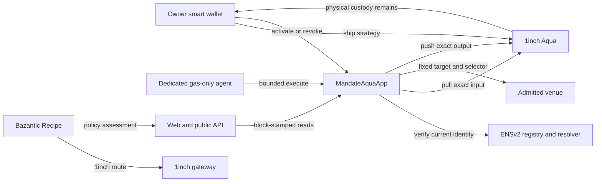

<p align="center">
  
</p>

# Mandate

**Programmable authority for autonomous execution without transferring treasury custody.**

Mandate lets a wallet owner authorize one dedicated agent to execute one narrowly defined strategy. The authority fixes the chain, contract, agent identity, token pair, venue, selector, rate floor, per-call cap, total cap, and time window. The owner retains the assets and can stop execution by revoking the mandate, invalidating the ENSv2 identity, or docking the Aqua strategy.

[Live application](https://mandate-cyan.vercel.app) | [Inspect the canonical demo](https://mandate-cyan.vercel.app/mandates/0x01163a9088c3c0342fd7d8b07f4720c5d52e1c9626cc114923ae4339414f9fcd?tx=0x0d4174a636098d3b0f717cb2e71d721aa646d6cf43ca61f9ae1460c1df75f164) | [OpenAPI](https://mandate-api.43-129-38-115.nip.io/openapi.json)

> Powered by Aqua - © Degensoft Ltd 2025

## AI use disclosure

AI was used as a supervised execution helper for bounded development tasks and as a research assistant. It was not used for unsupervised end-to-end project development. Architecture, product decisions, wallet approvals, deployment ownership, evidence review, and release sign-off remain human-directed.

## Why Mandate

Giving an agent a wallet key grants broad, persistent power. Giving it funds creates custody risk. A conventional allowlist still leaves critical limits in offchain policy.

Mandate makes the operating order an onchain boundary:

- the treasury owner remains the maker and keeps physical custody;
- a dedicated gas-only EOA can call only the activated strategy;
- ENSv2 identity ownership and resolution are checked live on every execution;
- 1inch Aqua accounts for strategy-scoped virtual balances;
- `MandateAquaApp` enforces exact target, selector, tokens, recipient, caps, time, and minimum output;
- temporary approvals are exact and return to zero;
- the app and agent retain no strategy tokens;
- missing, stale, or contradictory evidence becomes `UNKNOWN` or a revert, never a guessed success.

## Live proof

| Surface                      | Public endpoint or evidence                                                                                                                                                                                      |
| ---------------------------- | ---------------------------------------------------------------------------------------------------------------------------------------------------------------------------------------------------------------- |
| Web application              | [`mandate-cyan.vercel.app`](https://mandate-cyan.vercel.app)                                                                                                                                                     |
| Canonical Sepolia inspection | [Strategy `0x01163a...f9fcd`](https://mandate-cyan.vercel.app/mandates/0x01163a9088c3c0342fd7d8b07f4720c5d52e1c9626cc114923ae4339414f9fcd?tx=0x0d4174a636098d3b0f717cb2e71d721aa646d6cf43ca61f9ae1460c1df75f164) |
| Canonical execution          | [Sepolia transaction `0x0d4174...f164`](https://sepolia.etherscan.io/tx/0x0d4174a636098d3b0f717cb2e71d721aa646d6cf43ca61f9ae1460c1df75f164)                                                                      |
| Mandate contract             | [`0xFfDE...438F`](https://sepolia.etherscan.io/address/0xFfDEfE2eBB164095b471e1F0B7EC492c8D26438F#code), exact source match                                                                                      |
| Official Sepolia Aqua        | [`0x1111...a90a`](https://sepolia.etherscan.io/address/0x1111113CCf1426A8E30e2bfF5E005d929bF6a90a)                                                                                                               |
| ENSv2 identity               | `agent.mandate-test.eth`, bound to the dedicated agent at execution                                                                                                                                              |
| Public API                   | [`/openapi.json`](https://mandate-api.43-129-38-115.nip.io/openapi.json)                                                                                                                                         |
| Bazantic Recipe              | `mandate-1inch-route-assurance`                                                                                                                                                                                  |
| Recipe MCP                   | [`jtc64f.../recipe-mcp`](https://jtc64fcl6jbgzbohqrkfeu4may.bazgateway.com/recipe-mcp)                                                                                                                           |
| Installable safety skill     | `.agents/skills/mandate-constrained-execution`                                                                                                                                                                   |

The canonical transaction converts exactly 1 test USDC into 1 test DAI. Its persisted execution is `CONFIRMED`; current block-stamped inspection records the expected Aqua deltas and zero token balances on the app and agent. The historical receipt audit preserves `UNKNOWN` for unavailable execution-block ENS and Aqua reads instead of relabeling incomplete evidence as compliant. The public demo strategy has consumed its total cap, so it is an immutable inspection proof rather than reusable treasury authority.

## How it works



### Authority setup

1. The owner selects the dedicated agent identity and immutable strategy limits.
2. The UI derives the exact `StrategyV1` hash.
3. The owner grants Aqua an allowance bounded to `maxInputTotal`.
4. The owner ships the input and output token set to Aqua and activates the same hash in `MandateAquaApp`.
5. Every submitted transaction remains visible and owner-signed. No owner key enters Mandate infrastructure.

### Execution

1. The agent submits the exact strategy and route calldata.
2. The contract recomputes the hash and checks activation, revocation, caller, time, and cumulative caps.
3. It reads current ENSv2 registration, token ownership, resolver selection, and resolved address.
4. Aqua pulls the exact input from the maker under the strategy key.
5. The app calls only the fixed venue selector with an exact temporary allowance.
6. Measured output is pushed back through Aqua to the maker.
7. Any failed check, short output, partial spend, residue, or allowance mismatch reverts the complete transaction.

### Independent stop paths

- **Mandate revoke:** one-way contract state blocks the strategy.
- **ENSv2 identity invalidation:** unregistering or changing the live binding blocks execution even when the mandate remains activated.
- **Aqua dock:** closing the strategy balances removes the virtual allocation required for execution.

The recorded ENS stop proof includes a reverted agent transaction with `ENSNotRegistered()`. See [`docs/evidence/ensv2-sepolia.md`](docs/evidence/ensv2-sepolia.md).

## Sponsor integrations

### 1inch Aqua

Mandate uses official Sepolia Aqua for wallet-custodied, strategy-scoped accounting. `MandateAquaApp` pulls only the exact authorized input and pushes measured output back to the same maker. The separate pinned-mainnet-fork proof executes a captured live 1inch Classic route against official Aqua and real mainnet liquidity.

See [`docs/evidence/settlement.md`](docs/evidence/settlement.md).

### ENSv2

ENSv2 is a live authorization dependency, not a profile label. Execution reads the Permissioned Registry and selected resolver during the transaction. The expected current token owner and resolved address must both equal the dedicated agent.

See [`docs/evidence/ensv2-sepolia.md`](docs/evidence/ensv2-sepolia.md).

### Bazantic

The published Recipe calls two materially necessary tools:

1. 1inch `getClassicSwapRoute` obtains a live Ethereum mainnet route.
2. Mandate `assessOneInchRoute` decodes it and evaluates the immutable policy.

The assessor checks the chain, router, selector, caller, recipient, token pair, amount, native value, partial-fill setting, cap, rate floor, route minimum, and execution window. Provider availability alone cannot produce `PASS`. A paid two-gateway replay has canonical Base settlement transactions for both ingredients.

See [`docs/evidence/bazantic.md`](docs/evidence/bazantic.md).

## Repository map

| Path                  | Responsibility                                                                |
| --------------------- | ----------------------------------------------------------------------------- |
| `contracts/`          | `MandateAquaApp`, fixtures, deployment scripts, and Foundry invariant tests   |
| `apps/web/`           | Next.js issuance, public inspection, simulation, execution, and revocation UI |
| `apps/api/`           | Hono typed reads, simulation, receipt audit, and Bazantic assessor            |
| `apps/agent/`         | Dedicated policy-bound signer and narrow authenticated execution service      |
| `apps/worker/`        | Chain-specific confirmation, persistence, and reorg reconciliation            |
| `packages/domain/`    | Versioned schemas, IDs, reason codes, and values                              |
| `packages/chain/`     | Chain reads, transaction construction, simulation, and receipt decoding       |
| `packages/policy/`    | Pure deterministic preflight rules and explanations                           |
| `packages/db/`        | PostgreSQL migrations and canonical evidence repository                       |
| `packages/contracts/` | Generated ABI and checked-in deployment manifests                             |
| `skill/`              | Public, provider-neutral constrained-execution skill package                  |
| `docs/evidence/`      | Reproducible deployment, settlement, identity, Bazantic, and security records |

## Local setup

### Requirements

- Node.js `>=24.15.0 <25`
- pnpm `10.33.2` through Corepack
- Docker Desktop or Docker Engine for PostgreSQL
- Foundry `forge`, `cast`, and `anvil` for contract work

```bash
git clone https://github.com/febrinirwana/mandate.git
cd mandate
corepack enable
pnpm install --frozen-lockfile
```

Copy `.env.example` to an ignored `.env` and provide the services you intend to run. Never commit RPC credentials, database URLs, API keys, wallet material, agent private keys, or keystore passwords.

For local PostgreSQL:

```bash
docker compose up -d --wait postgres
pnpm --filter @mandate/db db:migrate
```

Run individual surfaces:

```bash
pnpm --filter @mandate/web dev
pnpm --filter @mandate/api serve
pnpm --filter @mandate/worker serve
pnpm --filter @mandate/agent serve
```

Default local endpoints are web `3100`, API `3001`, and agent `3002`. The worker intentionally exposes no HTTP port. Full environment and signer setup is documented in [`docs/technical/INSTALLATION.md`](docs/technical/INSTALLATION.md).

## Verification

Core release checks:

```bash
pnpm lint
pnpm test
pnpm typecheck
pnpm format:check
pnpm docs:verify
pnpm secrets:scan
pnpm build
```

Contract checks when Foundry is available:

```bash
forge fmt --check --root contracts
forge build --root contracts
forge test --root contracts
```

The pinned real-route settlement proof additionally requires an archival mainnet RPC:

```bash
SETTLEMENT_FORK_RPC_URL=https://... pnpm verify:venue
```

Tests cover wrong callers, activation and revoke state, cap and rate boundaries, expiry, ENS ownership/resolver failures, Aqua state, fee-on-transfer and false-return tokens, partial spend, wrong recipient, reentrancy, rollback, signer policy binding, stale simulation, canonical receipts, API schemas, and browser-visible state transitions.

## Install the constrained-execution skill

The repository publishes a reusable safety contract for coding agents:

```bash
npx skills add https://raw.githubusercontent.com/febrinirwana/mandate/main/.agents/skills/mandate-constrained-execution/SKILL.md --agent codex --copy -y
npx skills add https://raw.githubusercontent.com/febrinirwana/mandate/main/.agents/skills/mandate-constrained-execution/SKILL.md --agent claude-code --copy -y
```

The direct `SKILL.md` URL downloads only the 9 KB skill instead of cloning the full repository.

The skill requires typed intent, current authority inspection, exact simulation binding, fail-closed decisions, canonical receipt evidence, and strict secret handling. It does not grant access to the dedicated signer or any project credential.

## Deployment topology

- **Vercel:** public Next.js web and same-origin server routes.
- **VPS:** isolated API, worker, and authenticated agent containers.
- **Supabase:** PostgreSQL canonical evidence store.
- **Caddy:** TLS and bounded log rotation; no database or container port is published directly.
- **Sepolia:** owner authority, ENSv2 identity, official Aqua accounting, Mandate contract, and clearly labeled test venue.
- **Ethereum mainnet fork:** pinned replay of a captured live 1inch route.
- **Base:** canonical x402 payment settlement evidence for the Bazantic ingredient replay.

The browser never receives the database URL, RPC URL, agent bearer token, keystore, or signer material. The agent service has no generic transaction endpoint. It accepts any active onchain strategy hash only after independently enforcing the fixed chain, app, signer, ENS identity, token pair, route, one-to-one rate floor, and demo spend ceiling.

## Evidence and limitations

Start with [`docs/evidence/`](docs/evidence):

- [`security-review.md`](docs/evidence/security-review.md): scoped release security review and remediations.
- [`ensv2-sepolia.md`](docs/evidence/ensv2-sepolia.md): current deployment and historical identity-stop proof.
- [`settlement.md`](docs/evidence/settlement.md): production contract against a captured live 1inch route on a pinned mainnet fork.
- [`bazantic.md`](docs/evidence/bazantic.md): Recipe bindings, deterministic outcomes, and paid Base settlements.
- [`kickoff.md`](docs/evidence/kickoff.md): event-time requirements, source pins, and deployment provenance.

Honest boundaries:

- the Sepolia venue is a fixed, test-only USDC-to-DAI contract, not a claimed 1inch Sepolia deployment;
- the live 1inch route proof is Ethereum mainnet data replayed at a pinned mainnet fork block;
- the Bazantic route assessment is separate from the Sepolia execution receipt and does not claim cross-chain atomicity;
- the security report is a focused first-party review, not an independent audit;
- `PASS` is evidence-bound and time-bound, not a guarantee of future liquidity or inclusion.

## License and upstream notices

This repository includes pinned upstream dependencies with their own licenses and notices under the respective vendored directories. Aqua attribution and licensing requirements remain applicable to Aqua-derived components. See `contracts/lib/aqua/LICENSE` and `contracts/lib/aqua/LICENSES/` for the pinned source notices.
