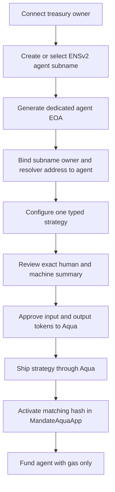
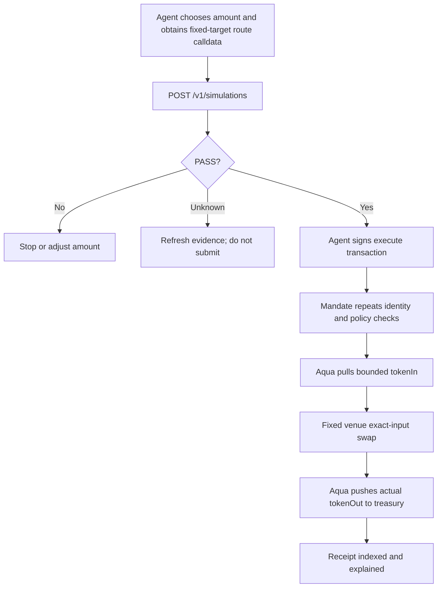

# Mandate Product Requirements Document

**Status:** Build-ready product specification  
**Product:** Mandate  
**Primary event:** ETHOnline 2026  
**Target integrations:** 1inch Aqua, ENSv2, Bazantic  
**Research snapshot:** 4 September 2026 at 23:37 WIB (UTC+7)

## 1. Product decision

> **Mandate lets a treasury give one named agent a revocable, expiring, onchain right to execute one immutable Aqua strategy without giving that agent custody of treasury assets.**

Mandate is an agent authority and settlement product. It is not an AI trading model, wallet, generic swap UI, asset manager, or claim that Aqua/ENS makes agent code safe.

## 2. Problem

Treasuries want automation but the common choices are structurally bad:

1. share or import the owner key into an agent runtime;
2. pre-fund an agent wallet and fragment custody;
3. grant a broad smart-account session permission that is difficult to explain;
4. trust an offchain API or prompt to enforce limits;
5. approve separate protocols and move capital into separate contracts.

None gives a reviewer one answer to: **who can act, on whose funds, through which exact path, for which pair, at what minimum rate, under which caps, until when, and how can it be stopped now?**

## 3. Product thesis

A useful mandate has three independent layers:

| Layer | Question | Enforcement |
|---|---|---|
| ENSv2 identity | Who is the current authorized signer and is the name active? | Permissioned Registry + resolver reads onchain |
| Mandate policy | What may that signer do and how far may funds move? | Immutable strategy plus app state |
| Aqua settlement | How do tokens move while owner custody is retained between actions? | Aqua virtual balances and app-only pull/push |

Removing any layer weakens the product: ENS alone is cosmetic; policy without settlement is a generic permission contract; Aqua without policy gives an app power but not a comprehensible authority lifecycle.

## 4. Target user

### Primary: protocol treasury operator

Owns USDC and wants an agent to convert limited USDC into WETH when an external decision system detects an opportunity. The owner wants the agent online without placing the treasury key in the runtime.

### Secondary: market maker or fund operator

Needs several operators eventually, but the MVP proves one dedicated signer and one mandate first.

### Secondary: auditor or agent developer

Needs typed simulation, stable reason codes, exact strategy fields, receipt evidence, and current revocation status.

### Explicit non-user

A retail user making a single manual swap. A normal wallet approval and aggregator UI is simpler for that case.

## 5. Jobs to be done

1. **Issue:** “Bind this dedicated signer and ENS identity to this exact strategy and budget.”
2. **Inspect:** “Show every effective limit and the remaining authority without connecting a wallet.”
3. **Simulate:** “Tell my agent whether this exact call would pass now and why.”
4. **Execute:** “Move at most the allowed input through the fixed venue and return output to my treasury.”
5. **Revoke:** “Stop the agent now without rotating the treasury wallet.”
6. **Audit:** “Prove which identity, policy, Aqua allocation, route, and actual token movement produced this receipt.”

## 6. Product principles

1. **Owner key never enters the agent runtime.**
2. **Agent authority is narrow by construction.** No user-selected target, selector, token, or recipient.
3. **Identity is evaluated at execution time.** Cached ENS answers cannot authorize.
4. **Contract and simulation share reason semantics, not authority.** Simulation may become stale.
5. **All successful settlement is atomic.** A failed route, output check, allowance reset, or Aqua push reverts everything.
6. **Amounts are base-unit integers.** No floating point in policy or accounting.
7. **Policy changes create a new strategy.** No mutable hidden configuration.
8. **Unknown fails closed.** RPC/ENS/deployment uncertainty blocks a positive result.

## 7. End-to-end journey

### 7.1 Owner setup



The owner signs ENS, token approval, Aqua ship, and Mandate activation transactions. UI must estimate and list them before the first signature.

### 7.2 Agent execution



### 7.3 Revocation

The owner selects one of three stop paths:

- `MandateAquaApp.revoke(strategyHash)`: fastest product-level stop;
- `Aqua.dock(app, strategyHash, tokens)`: clears Aqua strategy availability;
- ENSv2 unregister/expiry/address or ownership change: invalidates current identity.

The inspection page shows each path independently because one successful stop is enough, but each has different recovery semantics.

## 8. MVP scope

### 8.1 Required

- One non-upgradeable `MandateAquaApp` using pinned 1inch Aqua source/interfaces.
- One treasury-owned strategy with exactly two distinct ERC-20 tokens.
- One dedicated agent EOA funded only for gas.
- One live ENSv2 Permissioned Registry subname and Permissioned Resolver address record on Sepolia.
- Immutable fields: maker, agent, registry, resolver, labelhash, node, token pair, swap target, selector, minimum rate ratio, per-call cap, cumulative cap, valid-after, valid-until, and salt.
- Owner activation and one-way revocation.
- Deterministic read-only inspection and simulation API.
- Exact-input execution with balance-delta output verification, exact temporary allowance, allowance reset, and no successful residue.
- Receipt page with before/after physical balances, Aqua virtual balances, strategy hash, agent identity, cap usage, and decoded events.
- Focused Foundry unit, invariant, and integration tests.
- Functional ENSv2 deployment on Sepolia using current sponsor contracts.
- Real liquidity settlement proof on the same network if supported; otherwise a clearly labeled pinned fork proof plus a separate Sepolia identity proof.
- Bazantic account, new Mandate Inspector x402/MPP service, and one working Recipe combining it with a live 1inch service.
- Public repository history created during the event and a five-minute-or-shorter demo focused on issue, execute, revoke.

### 8.2 Strategy schema

```solidity
struct Strategy {
    address maker;
    address agent;
    address ensRegistry;
    address ensResolver;
    string ensLabel;
    bytes32 ensNode;
    address tokenIn;
    address tokenOut;
    address swapTarget;
    bytes4 swapSelector;
    uint256 minRateNumerator;
    uint256 minRateDenominator;
    uint256 maxInputPerCall;
    uint256 maxInputTotal;
    uint64 validAfter;
    uint64 validUntil;
    bytes32 salt;
}
```

All addresses must be nonzero; tokens must differ; numerator/denominator and caps must be nonzero; per-call cap cannot exceed total cap; `validUntil > validAfter`; the event-window maximum duration is configured at deployment. `ensLabel` is the normalized subname label only, not the full name; the contract derives `uint256(keccak256(bytes(ensLabel)))` for `getState` and uses the same label to verify the registry's current resolver.

### 8.3 Rate semantics

Token amounts are base units. Required output is calculated with overflow-safe ceiling division:

$$
minimumOutput(amountIn) = \left\lceil\frac{amountIn \times minRateNumerator}{minRateDenominator}\right\rceil
$$

The execution requirement is:

$$
actualOut \geq \max(agentMinOut, minimumOutput(amountIn))
$$

The immutable floor prevents a compromised agent from accepting a destructive rate; `agentMinOut` lets a healthy agent demand a better current quote.

### 8.4 Simulation response

```json
{
  "version": 1,
  "result": "PASS",
  "reasons": [],
  "binding": {
    "chainId": "11155111",
    "blockNumber": "0",
    "blockHash": "0x...",
    "caller": "0x...",
    "to": "0x...",
    "calldataHash": "0x...",
    "strategyHash": "0x...",
    "expiresAt": "2026-09-03T13:00:00Z"
  },
  "checks": [],
  "expectedMovement": {
    "makerTokenInDelta": "-500000000",
    "makerTokenOutMinimumDelta": "125000000000000000",
    "agentTokenDelta": "0"
  }
}
```

The example values are illustrative, not live quotes. Block `0` or ellipses are forbidden in a real response.

### 8.5 Stable result and reason model

Results: `PASS`, `FAIL`, `UNKNOWN`.

Minimum reason codes:

- `MANDATE_INACTIVE`, `MANDATE_REVOKED`, `MANDATE_NOT_STARTED`, `MANDATE_EXPIRED`
- `CALLER_NOT_AGENT`, `ENS_NOT_REGISTERED`, `ENS_EXPIRED`, `ENS_OWNER_MISMATCH`, `ENS_ADDRESS_MISMATCH`, `ENS_READ_UNAVAILABLE`
- `STRATEGY_HASH_MISMATCH`, `AQUA_STRATEGY_INACTIVE`, `AQUA_BALANCE_INSUFFICIENT`, `AQUA_READ_UNAVAILABLE`
- `INVALID_AMOUNT`, `PER_CALL_CAP_EXCEEDED`, `TOTAL_CAP_EXCEEDED`, `RATE_FLOOR_UNSATISFIED`
- `TARGET_MISMATCH`, `SELECTOR_MISMATCH`, `EXECUTION_DEADLINE_EXPIRED`, `ROUTE_REVERTED`
- `INPUT_NOT_FULLY_SPENT`, `OUTPUT_TOO_LOW`, `ALLOWANCE_NOT_CLEARED`, `SIMULATION_STALE`, `RECEIPT_NOT_CANONICAL`

A deterministic onchain custom error maps to one stable API code. Revert strings from external contracts remain untrusted details.

## 9. Functional requirements

### FR-1 Identity creation

Owner can register/select one ENSv2 subname, bind it to the dedicated EOA, and see current registry, label, node, token ID, owner, expiry, resolver, and address record.

Acceptance: changing ownership/address, unregistering, or letting the name expire causes execution to fail without changing Mandate storage.

### FR-2 Mandate authoring

Owner can enter only supported fields through a typed form. Human-readable summary and exact ABI values must appear together before signing.

Acceptance: unknown fields, floating amounts, unsupported chain/token/target, invalid time windows, and inconsistent caps are rejected.

### FR-3 Aqua setup

UI prepares exact sequence: ERC-20 approvals to Aqua, `ship(app, strategyBytes, [tokenIn, tokenOut], [maxInputTotal, 0])`, then `activate(strategy)`. Output token with zero initial balance remains part of the active strategy token set.

Acceptance: returned/emitted strategy hash matches local encoding and app activation; mismatch blocks progress.

### FR-4 Inspection

Public route shows current effective authority and all three stop states without wallet connection.

Acceptance: reads are block-stamped; stale or failed reads are `UNKNOWN`, not cached green state.

### FR-5 Simulation

API performs `eth_call`/estimation from the actual agent and returns decoded checks, exact binding, expected movement, and freshness.

Acceptance: changing caller, calldata, block context, route data, amount, deadline, strategy, or live ENS/Aqua state invalidates the simulation.

### FR-6 Execution

Only the dedicated EOA can execute. Contract enforces every immutable field and mutable cap/revocation state; external settlement is fixed target + selector only.

Acceptance: successful call leaves the app with no tokenIn/tokenOut balance attributable to the swap, no target allowance, output at the maker, and consistent Aqua virtual balances.

### FR-7 Revocation

Owner can revoke Mandate in one transaction; UI also exposes Aqua dock and ENS stop paths.

Acceptance: a previously passing identical execution reverts after each stop path in separate tests.

### FR-8 Receipt audit

Index confirmed receipts and compare actual events/balances with the active strategy at execution block.

Acceptance: reorged, reverted, missing, or mismatched evidence never receives “compliant” status.

### FR-9 Bazantic Recipe

Expose `GET /v1/receipts/{chainId}/{txHash}/audit` as a new paid service. The Recipe calls one live 1inch trace/data endpoint and this audit endpoint, then returns a single signed/attributable machine-readable result.

Acceptance: video shows start-to-finish paid invocation, both service contributions, and the exact transaction that determines the result.

## 10. Non-functional requirements

### Security

- No owner secret in server, browser storage, logs, fixtures, or CI.
- Agent key exists only in a server-side signer boundary for autonomous demo mode; manual agent wallet mode is supported for development.
- Reentrancy guard spans Aqua pull, external call, and Aqua push.
- Contract rejects native value and unsupported token behavior unless explicitly modeled.
- No upgradeability, delegatecall, arbitrary target, arbitrary recipient, or unlimited temporary router approval.
- Events contain enough data to reconstruct policy use; never emit secrets or route credentials.

### Reliability

- API is stateless for simulation; persistence is for mandates, block-stamped snapshots, executions, and audit evidence.
- Job and receipt ingestion is idempotent by `(chainId, txHash)`.
- Onchain state outranks database state.
- External timeouts become `UNKNOWN` with source-specific reason.

### Performance

- Inspection first response under 2 seconds at p95 excluding wallet/RPC outage.
- Simulation under 5 seconds at p95 for configured provider.
- No polling faster than chain block cadence; use event-driven refresh where available.
- UI animations affect transform/opacity only and respect reduced motion.

### Accessibility

Meet the contract in `PRODUCT.md` and `DESIGN-SYSTEMS.md`. The exact policy summary and revocation path cannot exist only in a tooltip, color, animation, or wallet modal.

## 11. Success metrics

### Hackathon proof metrics

- 1 successful bounded execution with real token movement.
- 4 failed attempts: wrong signer, per-call cap, poor output, expired/revoked identity.
- 3 verified stop paths.
- 0 treasury token transfer to the agent.
- 0 residual app token balance or route allowance after success.
- 1 paid Bazantic Recipe combining Mandate and 1inch evidence.
- All public claims tied to transaction, contract, commit, or recording evidence.

### Product signal after MVP

- owner time to issue first mandate;
- simulation failure prevented before gas spend;
- active authority by treasury and strategy;
- revocation latency;
- execution compliance rate;
- repeated use by the same operator.

Do not use TVL, token price, or model benchmark as MVP success metrics.

## 12. Demo script

1. “This treasury owns the tokens. This named agent owns only gas.”
2. Open mandate: show agent ENS identity, strategy hash, pair, fixed venue, rate floor, per-call cap, total remaining, and expiry.
3. Show Aqua physical and virtual balances.
4. Ask agent to simulate 500 USDC exact input. Show each `PASS` and expected movement.
5. Agent signs; show transaction and actual treasury output. Show no agent token custody and no app residue.
6. Attempt 2,000 USDC; show onchain cap revert.
7. Owner revokes the ENS/Mandate path.
8. Repeat the valid 500 USDC call; show authorization revert.
9. Run Bazantic Recipe on the successful transaction and show 1inch + Mandate evidence.

## 13. Explicit non-goals

- deciding when or why to trade;
- promising optimal price or safe execution;
- multiple agents/treasuries/strategies in one workflow;
- arbitrary protocols, chains, calls, recipients, or batch transactions;
- Robinhood Stock Tokens or RWA compliance;
- portfolio management, lending, leverage, credit, liquidation, or cross-margin;
- gas sponsorship or relaying in MVP;
- custom ENS resolver or generalized delegation standard;
- production key management or institutional compliance certification.

## 14. Post-MVP activation gates

### Signed intent + relayer

Build only after direct-agent execution is complete and tested. Add EIP-712 domain, nonce, deadline, agent signature, relayer submission, replay protection, queue state, and failure handling. Owner still never signs agent trades. This improves gas UX but expands the attack surface and is not required for the core proof.

### Smart-account session key

Build only if a target user needs sponsored transactions or account-native controls that do not duplicate Mandate. The smart account may constrain gas/user operations; Mandate remains the Aqua strategy and ENS authority boundary.

### Multi-strategy organization

Requires explicit policy versioning, operator roles, aggregate exposure caps, ordering/race semantics, and revocation UX. Do not add by copying the single-strategy mapping.

## 15. Release gates

1. Primary source revisions and deployment manifest verified.
2. Contract unit/invariant suite passes with malicious token/target fixtures.
3. Sepolia ENS identity and revocation proof succeeds.
4. Aqua pull/push integration succeeds with actual balance evidence.
5. Fixed venue probe succeeds or the demo is honestly split into Sepolia identity + pinned-fork settlement.
6. API schema, onchain errors, UI copy, and Bazantic response use the same reason codes.
7. Real browser flow passes at desktop and 375px width.
8. No secret scanner findings; no owner key in runtime.
9. Five-minute recording shows issue, pass, execute, receipt, revoke, fail.
10. Submission claims match public evidence and sponsor requirements rechecked at submission time.
