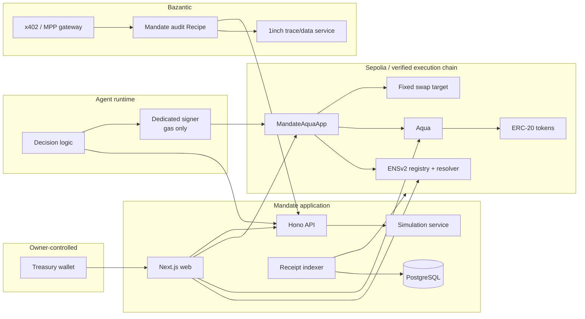
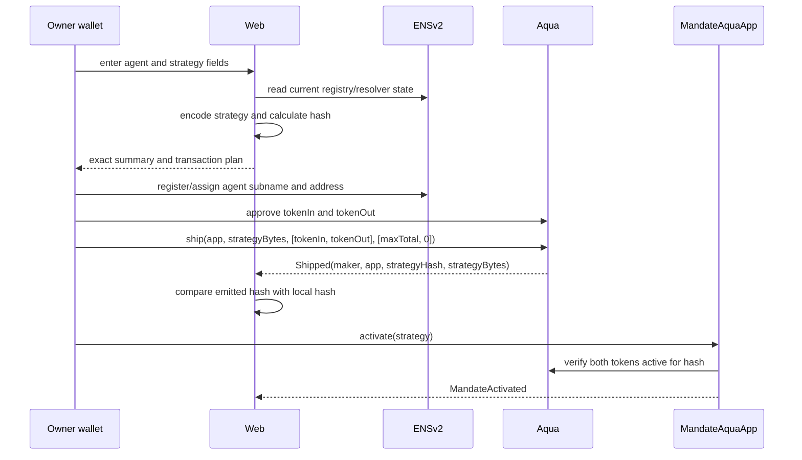
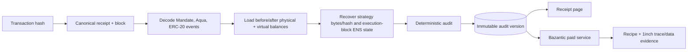

# Mandate Architecture

**Architecture style:** onchain authorization firewall with wallet-custodied settlement  
**Custody model:** treasury tokens stay in the maker wallet between executions; dedicated agent holds gas only  
**Canonical requirements:** [PRD](../PRD.md)

## 1. System boundary

Mandate owns:

- immutable strategy encoding and hashing;
- mandate activation, use accounting, and one-way revocation;
- live ENSv2 identity verification at execution;
- fixed-target exact-input execution constraints;
- Aqua pull/push orchestration and residue checks;
- deterministic simulation reason semantics;
- public authority inspection and receipt evidence;
- dedicated agent signer isolation;
- Bazantic-facing audit service.

Mandate does not own ENS/Aqua contracts, token implementations, venue liquidity, route generation, chain finality, price truth, the agent's decision model, or the treasury owner's wallet. Each is an explicit boundary.

## 2. Container architecture



## 3. Deployable units

| Unit | Responsibility | Explicitly does not do |
|---|---|---|
| `apps/web` | issuance, inspection, simulation display, wallet handoff, receipt UI, revocation | hold keys or decide trades |
| `apps/api` | typed reads, simulation orchestration, receipt audit, Bazantic endpoint | authorize execution or sign owner actions |
| `apps/agent` | optional demo decision loop and dedicated signer process | access owner key or arbitrary contracts |
| `apps/worker` | confirmed receipt ingestion, reorg reconciliation, audit jobs | infer compliance from submitted tx |
| `packages/domain` | schemas, values, IDs, reason codes | perform I/O |
| `packages/chain` | viem clients, ENS/Aqua/Mandate reads, calldata, simulation, receipt decode | retain private keys |
| `packages/policy` | pure preflight mirror and explanations | replace onchain checks |
| `packages/db` | migrations, repositories, transactions | become authority source |
| `contracts` | MandateAquaApp and exact Foundry tests | route discovery or offchain identity |
| `skill` | public agent instructions for safe simulation/execution | expose internal secrets |

Web, API, worker, and agent may run in one development process. The signer boundary remains a separate module/process interface so browser and API handlers cannot read key material.

## 4. Onchain authority model

### 4.1 Subjects

- `maker`: treasury owner and Aqua strategy maker.
- `agent`: dedicated EOA and current ENS identity owner/address.
- `app`: immutable `MandateAquaApp` address registered in Aqua's strategy key.
- `swapTarget`: immutable venue target; only `swapSelector` is callable.
- `recipient`: implicitly the maker; never supplied by the agent.

### 4.2 Authority sources

```text
Can execute =
  Mandate active
  AND not revoked
  AND current time in strategy window
  AND msg.sender == strategy.agent
  AND ENS registration active
  AND ENS current token owner == strategy.agent
  AND ENS resolved address == strategy.agent
  AND strategyHash matches encoded strategy
  AND Aqua strategy active with enough tokenIn virtual balance
  AND amount within per-call and remaining total caps
  AND target/selector fixed
  AND output meets immutable rate floor and agent minOut
```

All terms are checked during the same transaction. Offchain status is never in the conjunction.

## 5. Setup flow



Why output token is included with zero initial virtual balance: Aqua tracks the strategy's token set at ship time; a successful swap pushes output into that active allocation.

## 6. Execution flow

```mermaid
sequenceDiagram
  participant A as Agent EOA
  participant M as MandateAquaApp
  participant E as ENSv2
  participant Q as Aqua
  participant T as tokenIn
  participant V as Fixed venue
  participant U as tokenOut
  participant O as Owner wallet

  A->>M: execute(strategy, amountIn, agentMinOut, deadline, routeData)
  M->>M: hash, active, caller, time, caps, selector checks
  M->>E: status, current token ID/owner, expiry, addr
  E-->>M: live identity state
  M->>Q: safe/raw balance reads
  M->>M: reserve cumulative usage
  M->>Q: pull(owner, hash, tokenIn, amountIn, app)
  Q->>T: transferFrom(owner, app, amountIn)
  M->>T: exact approve(venue, amountIn)
  M->>V: call routeData
  V->>U: transfer output to app
  M->>M: clear input approval; measure deltas and residue
  M->>U: exact approve(Aqua, actualOut)
  M->>Q: push(owner, app, hash, tokenOut, actualOut)
  Q->>U: transferFrom(app, owner, actualOut)
  M->>M: require app balances and allowances returned to baseline
  M-->>A: MandateExecuted event
  Note over M,O: Any failure reverts usage, Aqua accounting, and token transfers atomically
```

The external venue return value is ignored for accounting. Only ERC-20 balance deltas count.

## 7. Simulation architecture

`POST /v1/simulations` accepts the full transaction intent and performs:

1. schema validation;
2. block-stamped ENS, Mandate, Aqua, token, and route preflight reads;
3. pure policy mirror producing ordered checks;
4. `eth_call` of exact `execute` calldata from the actual agent;
5. gas estimation when call passes;
6. response binding to chain, block/hash, caller, destination, calldata hash, strategy hash, and expiry.

`PASS` means the call succeeded against the observed state. It does not reserve liquidity, lock price, grant authority, or predict inclusion. UI/API invalidates it when the next relevant block/event, wallet, amount, calldata, deadline, or route changes.

## 8. Receipt and audit flow



Audit result is `COMPLIANT` only when canonical evidence proves every required relationship. Missing archival state, reorg, decode mismatch, or unavailable external trace yields `UNKNOWN`.

## 9. Data authority and caching

| Data | Authority | Cache rule |
|---|---|---|
| mandate active/revoked/used | Mandate contract at block | invalidate on event/new block |
| strategy token balances | Aqua contract at block | never infer from physical wallet balance |
| physical token balances | ERC-20 at block | block-tagged only |
| agent name status/owner/expiry | ENSv2 registry at block | must refresh before simulation/execution |
| resolved address | selected ENSv2 resolver at block | must equal stored agent |
| route quote | venue/1inch response | expires independently; not authority |
| receipt | canonical RPC block/receipt | confirmed then reorg monitored |
| explanation | deterministic renderer | regenerated from versioned values |

The database is a read model. Contract reads at an explicit block own current truth.

## 10. Key architecture

### Treasury owner

Browser wallet or hardware wallet only. The backend never requests, stores, logs, or signs with this key.

### Dedicated agent

MVP options in order:

1. server-side encrypted keystore loaded into a signer process through a secret manager/environment injection;
2. manual dedicated browser wallet for demonstration/development.

The address is shown to owner before ENS/mandate setup. Fund with bounded gas only. No token allowances from the treasury to the agent and no treasury tokens sent to it.

### Post-MVP relayer

Separate EIP-712 signed intent and replay domain. It cannot be silently added to direct `msg.sender` authorization because relaying changes the signer/caller model.

## 11. Deployment topology

### Canonical sponsor proof

ENSv2 functionality runs on Sepolia as required by the current track. Deployment manifest records official registry/resolver addresses and bytecode hashes.

### Aqua

At kickoff:

- if compatible official Aqua exists on Sepolia, use and verify it;
- otherwise deploy pinned Aqua source to Sepolia and label it `self-deployed sponsor source`;
- never claim a self-deployed address is official.

### Settlement venue

Prefer a real exact-input route on the same network. If unavailable, split evidence:

- Sepolia: functional ENSv2 + Mandate + Aqua authorization/revocation;
- pinned fork of a supported chain: real token/venue settlement and receipt.

A deterministic fixture venue may exist only in unit tests and is labeled as such.

## 12. Failure containment

| Failure | Behavior |
|---|---|
| ENS read reverts or returns inactive | execution reverts; simulation `UNKNOWN` or `FAIL` by known state |
| agent key compromised | attacker limited to one strategy and remaining caps; owner revokes/docks/ENS-stops |
| route reverts | whole transaction reverts; no use/custody change |
| output below floor | whole transaction reverts |
| input not fully spent or allowance remains | whole transaction reverts |
| Aqua push fails | external route and pull revert atomically |
| receipt reorged | mark audit non-canonical and regenerate after confirmation |
| API/Bazantic unavailable | direct onchain execution remains possible; no false receipt claim |
| owner key compromised | outside Mandate containment; owner controls approvals and all stop paths |

## 13. Threat model

Highest-priority adversaries:

1. compromised agent signer trying arbitrary calldata;
2. malicious or misconfigured fixed venue;
3. token with non-standard transfer/approval behavior;
4. stale/cached ENS identity;
5. reentrancy during venue call or token callback;
6. API falsely presenting a stale pass;
7. database/receipt reorg inconsistency;
8. leaked owner or agent key through logs/browser bundles.

Contract invariants and tests are detailed in [SMART-CONTRACT](./SMART-CONTRACT.md).
