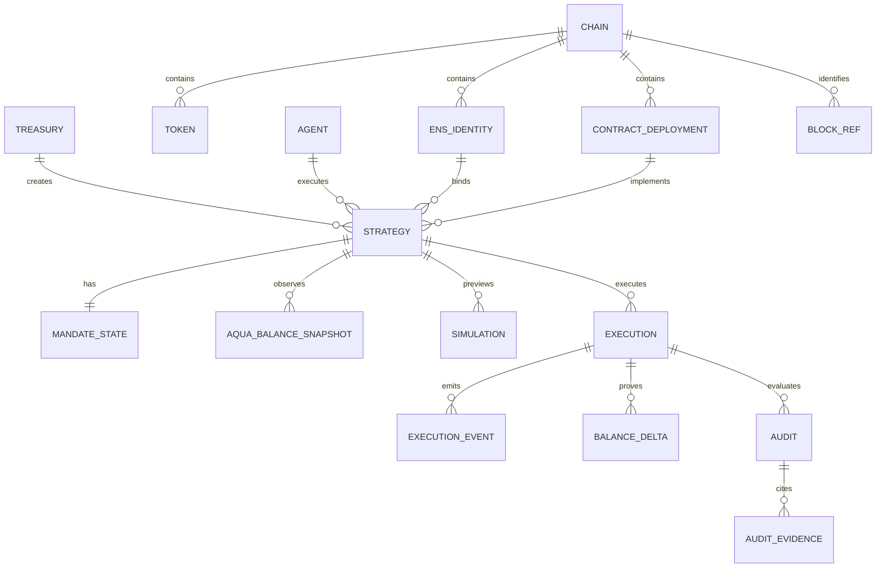

# Mandate Entity and Relationship Model

## 1. Modeling rules

1. Onchain state is authoritative; PostgreSQL is a versioned read/audit model.
2. Every chain-scoped identity includes `chain_id`.
3. Addresses and hashes are binary or validated lowercase hex at boundaries; display checksum is derived.
4. Token amounts, blocks, nonces, rate terms, and timestamps use exact integer/decimal-string representations.
5. Strategy rows are immutable. Revocation and usage are separate observations/events.
6. Receipt-derived compliance is immutable per audit version and canonical block hash; reorg creates invalidation, not silent mutation.
7. ENS display names are untrusted labels; execution identity records registry, label identifier, node, current token ID, owner, expiry, resolver, and address.

## 2. Domain graph



## 3. Onchain state

### `MandateAquaApp`

```solidity
mapping(bytes32 strategyHash => MandateState) public mandates;

struct MandateState {
    address maker;
    uint128 usedInput;
    bool activated;
    bool revoked;
}
```

If supported caps exceed `uint128`, use `uint256` consistently. Do not truncate. Strategy fields remain calldata/event data and are proven by hash; only mutable execution state is stored.

### Aqua

External authoritative key:

`maker -> app -> strategyHash -> token -> (balance, tokensCount)`

Mandate never duplicates this balance as authoritative contract storage.

### ENSv2

External identity references:

- registry address;
- normalized subname label string;
- derived label ID `uint256(keccak256(bytes(label)))`;
- current `State.tokenId`, status, and expiry from `getState(labelId)`;
- current owner from `ownerOf(State.tokenId)`;
- current registry resolver pointer, pinned resolver address, and full name node;
- current `addr(node)` from that resolver.

## 4. PostgreSQL schema

### `chains`

| Column | Type | Constraint |
|---|---|---|
| `chain_id` | `numeric(78,0)` | primary key |
| `name` | `text` | not null |
| `confirmation_depth` | `integer` | non-negative |
| `enabled` | `boolean` | not null |

### `contract_deployments`

| Column | Type | Constraint |
|---|---|---|
| `id` | `uuid` | primary key |
| `chain_id` | numeric | FK chains |
| `kind` | text | `AQUA`, `MANDATE_APP`, `ENS_REGISTRY`, `ENS_RESOLVER`, `SWAP_TARGET` |
| `address` | bytea | 20 bytes |
| `code_hash` | bytea | 32 bytes |
| `source_revision` | text | not null |
| `official` | boolean | distinguishes sponsor vs self-deployed |
| `verified_at_block` | numeric | not null |
| `verified_at_hash` | bytea | 32 bytes |

Unique `(chain_id, kind, address, code_hash)`.

### `tokens`

| Column | Type | Constraint |
|---|---|---|
| `chain_id` | numeric | FK chains |
| `address` | bytea | composite PK |
| `decimals` | smallint | 0–255, verified |
| `symbol` | text | display only |
| `behavior_profile` | text | `STANDARD` or explicit unsupported reason |
| `code_hash` | bytea | 32 bytes |

### `treasuries`

| Column | Type | Constraint |
|---|---|---|
| `id` | uuid | primary key |
| `chain_id` | numeric | FK chains |
| `address` | bytea | unique per chain |
| `label` | text | optional display label |

No owner secrets or wallet session tokens.

### `agents`

| Column | Type | Constraint |
|---|---|---|
| `id` | uuid | primary key |
| `chain_id` | numeric | FK chains |
| `address` | bytea | unique per chain |
| `custody_mode` | text | `MANUAL_EOA` or `SERVER_KEYSTORE` |
| `created_at` | timestamptz | not null |

Never store private key, mnemonic, raw keystore password, or signed transaction payload in this table.

### `ens_identities`

Immutable identity binding used by a strategy:

| Column | Type | Constraint |
|---|---|---|
| `id` | uuid | primary key |
| `chain_id` | numeric | FK chains |
| `registry_address` | bytea | not null |
| `resolver_address` | bytea | not null |
| `label` | text | normalized subname label only |
| `label_id` | numeric | derived exact uint256 labelhash |
| `node` | bytea | 32-byte full-name node |
| `display_name` | text | untrusted full-name display |

Unique `(chain_id, registry_address, label, resolver_address, node)`; `label_id` must equal the deterministic hash of `label`.

### `strategies`

| Column | Type | Constraint |
|---|---|---|
| `chain_id` | numeric | composite PK |
| `strategy_hash` | bytea | composite PK, 32 bytes |
| `maker_address` | bytea | FK treasury identity |
| `agent_address` | bytea | FK agent identity |
| `ens_identity_id` | uuid | FK ens_identities |
| `mandate_app` | bytea | 20 bytes |
| `aqua_address` | bytea | 20 bytes |
| `token_in` | bytea | FK tokens |
| `token_out` | bytea | FK tokens, differs from input |
| `swap_target` | bytea | verified deployment |
| `swap_selector` | bytea | 4 bytes |
| `min_rate_numerator` | numeric(78,0) | positive |
| `min_rate_denominator` | numeric(78,0) | positive |
| `max_input_per_call` | numeric(78,0) | positive |
| `max_input_total` | numeric(78,0) | >= per call |
| `valid_after` | numeric(78,0) | uint64 range |
| `valid_until` | numeric(78,0) | greater than valid after |
| `salt` | bytea | 32 bytes |
| `strategy_bytes` | bytea | exact ABI encoding |
| `shipped_tx_hash` | bytea | 32 bytes |
| `activated_tx_hash` | bytea | 32 bytes |

Strategy rows never update. Corrected provenance creates a superseding record/audit annotation; policy change creates a new hash.

### `mandate_state_snapshots`

| Column | Type | Constraint |
|---|---|---|
| `id` | uuid | primary key |
| strategy identity | chain + hash | FK strategies |
| `block_number` | numeric | not null |
| `block_hash` | bytea | 32 bytes |
| `activated` | boolean | not null |
| `revoked` | boolean | not null |
| `used_input` | numeric(78,0) | non-negative |
| `ens_status` | text | raw enum/value |
| `ens_token_id` | numeric(78,0) | current token ID |
| `ens_owner` | bytea | observed owner |
| `ens_expiry` | numeric(78,0) | observed timestamp |
| `ens_address` | bytea | resolved address |
| `result` | text | PASS/FAIL/UNKNOWN |

Unique `(chain_id, strategy_hash, block_hash)`.

### `aqua_balance_snapshots`

One row per token and block:

| Column | Type |
|---|---|
| strategy identity + token + block hash | composite key |
| `raw_balance` | numeric(78,0) |
| `tokens_count` | smallint |
| `read_status` | text |
| `observed_at` | timestamptz |

Never call this a wallet balance.

### `simulations`

| Column | Type | Constraint |
|---|---|---|
| `id` | uuid | primary key |
| strategy identity | chain + hash | FK strategies |
| `caller` | bytea | 20 bytes |
| `to_address` | bytea | Mandate app |
| `calldata_hash` | bytea | 32 bytes |
| `block_number` / `block_hash` | numeric / bytea | exact context |
| `result` | text | PASS/FAIL/UNKNOWN |
| `checks_json` | jsonb | validated versioned schema |
| `expected_movement_json` | jsonb | decimal strings |
| `expires_at` | timestamptz | advisory freshness |
| `created_at` | timestamptz | not null |

No signed transaction or private key material.

### `executions`

| Column | Type | Constraint |
|---|---|---|
| `chain_id` | numeric | composite PK |
| `tx_hash` | bytea | composite PK |
| strategy identity | chain + hash | FK strategies |
| `caller` | bytea | actual sender |
| `amount_in` | numeric(78,0) | event value |
| `amount_out` | numeric(78,0) | event value |
| `used_input_after` | numeric(78,0) | event value |
| `status` | text | SUBMITTED/CONFIRMED/REVERTED/REORGED |
| `block_number` | numeric | nullable until mined |
| `block_hash` | bytea | nullable until mined |
| `transaction_index` | integer | canonical ordering |
| `confirmation_count` | integer | derived at refresh |

Submission is never sufficient for confirmed state.

### `execution_events`

Canonical key: `(chain_id, block_hash, tx_hash, log_index)`. Store contract, topic0, raw topics/data, decoded event kind, validated decoded JSON, and decoder version.

### `balance_deltas`

| Column | Type |
|---|---|
| execution identity | FK executions |
| account | maker/agent/app |
| token | FK tokens |
| before/after block refs | exact refs |
| before/after/delta | numeric(78,0) signed where required |
| source | RPC_CALL/EVENT_RECONSTRUCTION |

The hackathon proof must include maker, agent, and app for both tokens.

### `audits` and `audit_evidence`

Audit key: execution + `audit_version` + canonical block hash. Result is `COMPLIANT`, `NON_COMPLIANT`, or `UNKNOWN`. Evidence rows cite source type, provider/service, block/hash, contract, method/event, response hash, and optional URI. Reorg invalidation records `invalidated_at` and reason; it does not delete the old audit.

## 5. Idempotency and transaction rules

- Upsert submitted transaction by `(chain_id, tx_hash)`.
- Receipt, decoded events, balance deltas, and audit commit in one database transaction.
- Same canonical receipt replay produces identical keys and no duplicate events.
- A block-hash change marks the prior execution/audit `REORGED`/invalid; new canonical evidence creates new rows.
- Strategy and contract-deployment rows are append-only.
- Snapshot consumers request one explicit block; no latest-state join across different blocks.

## 6. Retention and secrets

Retain public onchain evidence, normalized audits, and response hashes. Do not persist owner/agent secrets, bearer tokens, RPC credentials, Bazantic credentials, full signed raw transactions, or sensitive route authorization headers. Logs carry request IDs and hashes, not payload secrets.
